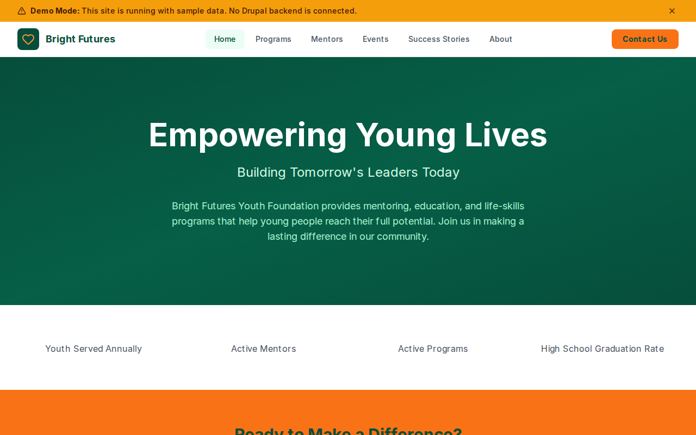

# Decoupled Youth

A youth foundation and nonprofit website built with Next.js and Drupal, designed for youth-serving organizations, mentoring programs, after-school initiatives, and community foundations. Showcase programs, highlight mentors, promote events, and share success stories to attract volunteers and donors.



## Features

- **Youth Programs** -- Browse programs with age groups, schedules, and locations (STEM Explorers, Leadership Academy, Creative Arts Workshop, Academic Tutoring)
- **Mentor Profiles** -- Highlight volunteer mentors with specialties, experience, and contact information
- **Community Events** -- Promote fundraising galas, summer camps, mentor orientations, and workshops with dates, locations, and registration links
- **Success Stories** -- Share inspiring stories of youth participants whose lives have been transformed
- **Homepage Hero & Stats** -- Welcome visitors with impact statistics (2,500+ youth served, 180+ mentors, 95% graduation rate)
- **Contact Page** -- Foundation contact info, hours, and inquiry form for volunteers, families, and donors
- **Demo Mode** -- Preview the full site with sample content, no backend required

## Quick Start

```bash
npx degit nicobrinkkemper/decoupled-youth my-youth-foundation
cd my-youth-foundation
npm install
npm run setup
npm run dev
```

Visit [http://localhost:3000](http://localhost:3000)

## Manual Setup

<details>
<summary>Click to expand manual setup steps</summary>

### Authenticate with Decoupled.io

```bash
npx decoupled-cli@latest auth login
```

### Create a Drupal space

```bash
npx decoupled-cli@latest spaces create "Bright Futures Youth Foundation"
```

Note the space ID returned (e.g., `Space ID: 1234`). Wait ~90 seconds for provisioning.

### Configure environment

```bash
npx decoupled-cli@latest spaces env 1234 --write .env.local
```

### Import content

```bash
npm run setup-content
```

This imports the following sample content:

- **Programs:** STEM Explorers, Leadership Academy, Creative Arts Workshop, Academic Tutoring & Homework Help
- **Mentors:** Marcus Williams (STEM), Lisa Chen (Academic), Carlos Rodriguez (Creative Arts), Sarah Thompson (Leadership)
- **Events:** Annual Bright Futures Gala, Summer Adventure Camp 2026, Spring Mentor Orientation
- **Success Stories:** Jaylen Finds His Passion for Coding, Maria Leads the Way, Devon's Artistic Transformation
- **Pages:** About Bright Futures Youth Foundation, Volunteer With Us

</details>

## Content Types

### Youth Program
| Field | Type | Description |
|-------|------|-------------|
| Title | string | Program name (e.g., "STEM Explorers") |
| Body | text | Full program description with HTML |
| Program Area | taxonomy | Area of focus (STEM, Leadership, Arts, Academic) |
| Age Group | taxonomy | Target age group (Children 6-12, Teens 13-17) |
| Schedule | string | Meeting schedule (e.g., "Tuesdays & Thursdays, 4:00 PM") |
| Location | string | Program location |
| Image | image | Featured program photo |

### Mentor
| Field | Type | Description |
|-------|------|-------------|
| Title | string | Mentor name |
| Body | text | Bio and mentoring philosophy |
| Specialty | string | Area of expertise (e.g., "STEM Education & Coding") |
| Email | string | Contact email |
| Phone | string | Contact phone |
| Photo | image | Mentor headshot |
| Years Experience | integer | Years of mentoring experience |

### Community Event
| Field | Type | Description |
|-------|------|-------------|
| Title | string | Event name |
| Body | text | Full event description |
| Event Date | datetime | Start date and time |
| End Date | datetime | End date and time |
| Location | string | Event venue |
| Event Type | taxonomy | Category (fundraiser, camp, workshop) |
| Registration URL | string | Registration link |
| Image | image | Event photo |

### Success Story
| Field | Type | Description |
|-------|------|-------------|
| Title | string | Story headline |
| Body | text | Full story with quotes |
| Image | image | Featured photo |
| Featured | boolean | Whether to highlight on homepage |
| Participant Name | string | Youth participant name |
| Program Area | taxonomy | Related program area |

## Customization

### Colors & Branding
Edit `tailwind.config.js` to customize the foundation's color palette, fonts, and spacing. The default theme uses emerald greens and warm oranges.

### Content Structure
Modify `data/youth-content.json` to add new programs, mentors, events, or success stories, or adjust existing sample content.

### Components
React components are in `app/components/`. Key files:
- `HomepageRenderer.tsx` -- Landing page layout with hero, stats, and CTA
- `ProgramCard.tsx` -- Program listing card
- `MentorCard.tsx` -- Mentor profile card
- `EventCard.tsx` -- Event listing card
- `SuccessStoryCard.tsx` -- Success story card
- `Header.tsx` -- Navigation bar

## Demo Mode

Demo mode displays the full site with mock content, no Drupal backend required.

### Enable Demo Mode

```bash
NEXT_PUBLIC_DEMO_MODE=true npm run dev
```

Or add to `.env.local`:
```
NEXT_PUBLIC_DEMO_MODE=true
```

### Removing Demo Mode

To convert to a production app with real data:

1. Delete `lib/demo-mode.ts`
2. Delete `data/mock/` directory
3. Delete `app/components/DemoModeBanner.tsx`
4. Remove `DemoModeBanner` from `app/layout.tsx`
5. Remove demo mode checks from `app/api/graphql/route.ts`

## Deployment

### Vercel (Recommended)
[](https://vercel.com/new/clone?repository-url=https://github.com/nicobrinkkemper/decoupled-youth&project-name=bright-futures-youth)

Set `NEXT_PUBLIC_DEMO_MODE=true` in Vercel environment variables for a demo deployment.

### Other Platforms
Works with any Node.js hosting platform that supports Next.js.

## Documentation

- [Decoupled.io Docs](https://www.decoupled.io/docs)
- [Next.js Documentation](https://nextjs.org/docs)
- [Drupal GraphQL](https://www.decoupled.io/docs/graphql)

## License

MIT
